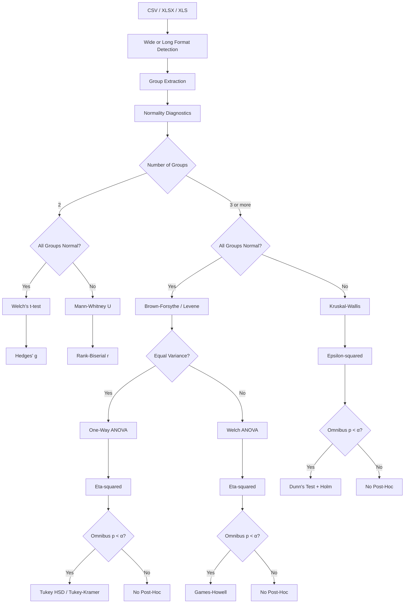

# ViolinsOfJulia

[](https://julialang.org/)
[](https://github.com/RDwithMATLAB)
[](https://gemini.google.com/)
[](LICENSE)
[](https://github.com/RDwithMATLAB/violinsofjulia)

**ViolinsOfJulia** is a Julia-based automated statistics and scientific plotting pipeline for biological and experimental datasets.

It combines a predefined statistical decision tree with publication-oriented visualization and a detailed Excel audit report. The pipeline accepts common tabular data formats, automatically identifies experimental groups, evaluates distributional and variance characteristics, selects an appropriate statistical pathway, performs omnibus-gated post-hoc testing, calculates effect sizes, and produces an editable vector SVG figure.

---

## Table of Contents

- [Overview](#overview)
- [Key Features](#key-features)
- [Pipeline Workflow](#pipeline-workflow)
- [Input Data](#input-data)
- [Statistical Decision Tree](#statistical-decision-tree)
- [Statistical Tests](#statistical-tests)
- [Effect Sizes](#effect-sizes)
- [Post-Hoc Gating and Multiplicity](#post-hoc-gating-and-multiplicity)
- [Excel Audit Report](#excel-audit-report)
- [Publication Figure](#publication-figure)
- [Y-Axis Label Formatter](#y-axis-label-formatter)
- [Installation](#installation)
- [Running ViolinsOfJulia](#running-violinsjulia)
- [Configuring the Analysis](#configuring-the-analysis)
- [Output Files](#output-files)
- [Repository Structure](#repository-structure)
- [Reproducibility](#reproducibility)
- [Statistical Assumptions](#statistical-assumptions)
- [Important Limitations](#important-limitations)
- [GitHub Deployment](#github-deployment)
- [Citation and Reporting](#citation-and-reporting)
- [License](#license)

---

# Overview

The main analysis program is:

```text
src/Publication_Grade_Statistics.jl
```

The script is organized into five major sections:

```text
SECTION 0
User Configuration

SECTION 1
Universal Data Ingestion & Unicode Label Engine

SECTION 2
Statistical Engines & Post-Hoc Testing

SECTION 3
Decision Tree Runner & Report Export

SECTION 4
Scientific Plotting Engine

SECTION 5
Pipeline Execution
```

At runtime the pipeline:

```text
Input CSV / XLSX / XLS
        │
        ▼
Data loading
        │
        ▼
Wide / Long format detection
        │
        ▼
Experimental group extraction
        │
        ▼
Group-wise descriptive statistics
        │
        ▼
Normality diagnostics
        │
        ▼
Variance diagnostics
        │
        ▼
Statistical decision tree
        │
        ├───────────────┐
        │               │
        ▼               ▼
Primary test       Omnibus test
                        │
                        ▼
               Significant omnibus?
                    │       │
                   Yes      No
                    │       │
                    ▼       ▼
                 Post-hoc   Stop
                    │
                    ▼
              Effect sizes
                    │
          ┌─────────┴─────────┐
          ▼                   ▼
     Excel audit          SVG figure
```

---

# Key Features

### 1. Universal data ingestion

The pipeline supports:

- `.csv`
- `.xlsx`
- `.xls`

It can interpret:

- **wide format** — each numeric column represents an experimental group;
- **long/tidy format** — column 1 represents group identity and column 2 represents the numerical measurement.

### 2. Automated statistical decision tree

The analysis does not simply apply one statistical test to every dataset.

It evaluates:

- Shapiro-Wilk normality;
- skewness;
- excess kurtosis;
- a predefined CLT robustness criterion;
- median-centered Brown-Forsythe/Levene variance testing;
- number of experimental groups.

These diagnostics determine the subsequent parametric, heteroscedastic, or non-parametric branch.

### 3. Omnibus-gated post-hoc testing

For ≥3 groups, pairwise post-hoc testing is only performed when the selected omnibus test is significant.

The pipeline therefore follows:

```text
Omnibus test
     │
     ├── p < 0.05 ──► Post-hoc testing
     │
     └── p ≥ 0.05 ──► No post-hoc testing
```

### 4. Effect-size reporting

The pipeline reports effect sizes in addition to p-values:

- Hedges' g
- rank-biserial correlation
- η²
- ε²R

### 5. Publication-oriented visualization

The SVG figure can contain:

- violin distributions;
- individual observations;
- jittered raw points;
- mean ± SEM;
- significance brackets;
- significance stars;
- exact p-values;
- statistical test description.

### 6. Seven-part Excel audit report

The statistical analysis is exported as a structured workbook containing the decision-making information needed to inspect how the final test was selected.

---

# Pipeline Workflow

## Step 1 — Load the dataset

The configured path is defined near the beginning of the Julia script:

```julia
const INPUT_PATH = raw"C:/path/to/your/dataset.csv"
```

The loader checks that the file exists and determines its extension.

---

## Step 2 — Detect the data structure

For a two-column table, ViolinsOfJulia first checks whether it resembles:

```text
Group        Value
Control      10.2
Control      11.4
Treatment    16.3
Treatment    15.8
```

If so, it is treated as long/tidy data.

Otherwise the pipeline falls back to wide format:

```text
Control    Treatment_A    Treatment_B
10.2       16.3           21.1
11.4       15.8           20.4
12.0       17.2           22.0
```

Each usable numeric column becomes a group.

Missing, non-finite, or non-convertible observations are ignored during extraction.

---

# Statistical Decision Tree



---

# Statistical Tests

## Two-group parametric branch

When both groups pass the normality decision:

### Welch's t-test

The implementation uses the unequal-variance form of the two-sample t-test.

Reported values include:

- t statistic;
- degrees of freedom;
- p-value;
- significance classification;
- Hedges' g.

---

## Two-group non-parametric branch

When the normality decision is not satisfied:

### Mann-Whitney U

The implementation contains a manual rank-based calculation with tied-rank handling.

Reported values include:

- U statistic;
- p-value;
- rank-biserial correlation.

---

## Three-or-more-group parametric branch

When all groups satisfy the normality decision, the pipeline evaluates variance homogeneity.

### Equal variance

If the Brown-Forsythe/Levene test gives:

```text
p > α
```

the pipeline uses:

### One-way ANOVA

The report includes:

- F statistic;
- between-group degrees of freedom;
- within-group degrees of freedom;
- p-value;
- η²;
- within-group mean square.

If the omnibus test is significant, Tukey HSD/Tukey-Kramer comparisons are generated.

### Unequal variance

If:

```text
p ≤ α
```

the pipeline uses:

### Welch ANOVA

The report includes:

- Welch F statistic;
- numerator degrees of freedom;
- denominator degrees of freedom;
- p-value;
- η².

If significant, Games-Howell pairwise comparisons are generated.

---

## Three-or-more-group non-parametric branch

If not all groups satisfy the normality decision:

### Kruskal-Wallis

The pipeline uses rank-based analysis for the omnibus comparison.

If significant:

### Dunn's pairwise test + Holm adjustment

The pairwise p-values are adjusted using Holm's step-down procedure.

---

# Normality Decision

For each group the pipeline calculates:

- sample size;
- Shapiro-Wilk W;
- Shapiro-Wilk p-value;
- skewness;
- excess kurtosis;
- CLT robustness flag.

The implemented CLT robustness rule is:

```text
n ≥ 30
AND
|skewness| ≤ 1
AND
|excess kurtosis| ≤ 2
```

When this condition is met, the group can be considered sufficiently robust for the parametric branch even when the Shapiro-Wilk result alone would not establish normality.

This is an explicit rule encoded in the pipeline and should be interpreted as a methodological choice rather than a universal statistical law.

---

# Variance Testing

For ≥3 groups the pipeline performs a median-centered variance diagnostic.

It first calculates:

```text
|observation − group median|
```

for every observation and then performs the corresponding one-way ANOVA on those absolute deviations.

This is used as the Brown-Forsythe/Levene variance decision.

The resulting classification is:

```text
p > α  → Homoscedastic
p ≤ α  → Heteroscedastic
```

For two-group analyses, the variance decision is not used to select between equal- and unequal-variance t-tests. The parametric branch directly uses Welch's t-test.

---

# Effect Sizes

## Hedges' g

Used for two-group parametric comparisons and pairwise parametric post-hoc comparisons.

Hedges' g is a small-sample bias-corrected standardized mean difference.

---

## Rank-Biserial Correlation

Used for:

- Mann-Whitney U;
- Dunn pairwise comparisons.

It provides a direction-aware non-parametric effect-size measure.

---

## Eta-squared (η²)

Used for:

- one-way ANOVA;
- Welch ANOVA in the current implementation.

It summarizes the proportion of observed variation attributable to the group factor.

---

## Epsilon-squared (ε²R)

Used for the Kruskal-Wallis branch as a non-parametric omnibus effect-size measure.

---

# Post-Hoc Gating and Multiplicity

ViolinsOfJulia intentionally separates omnibus testing from pairwise testing.

For ≥3 groups:

```text
Primary omnibus test
       │
       ├── significant ──► pairwise post-hoc
       │
       └── non-significant ──► no pairwise post-hoc
```

The implemented post-hoc procedures are:

| Omnibus pathway | Post-hoc |
|---|---|
| One-way ANOVA | Tukey HSD / Tukey-Kramer |
| Welch ANOVA | Games-Howell |
| Kruskal-Wallis | Dunn + Holm |

Only significant adjusted pairwise comparisons are drawn on the final figure.

---

# Excel Audit Report

For an input such as:

```text
AvgAcc_mm.csv
```

the pipeline creates:

```text
AvgAcc_mm_stats.xlsx
```

The workbook contains seven analysis sections.

## 1. `Executive_Summary`

Contains the high-level analysis result:

- input dataset;
- analysis timestamp;
- number of groups;
- sample-size range;
- distribution verdict;
- variance verdict;
- selected test;
- statistic;
- p-value;
- significance classification;
- effect size;
- post-hoc correction;
- number of pairwise comparisons;
- number of significant pairwise comparisons.

---

## 2. `Descriptive_Statistics`

Reports, per group:

- N;
- mean;
- SEM;
- SD;
- median;
- IQR;
- 25th percentile;
- 75th percentile;
- minimum;
- maximum;
- skewness;
- excess kurtosis.

---

## 3. `Normality_Diagnostics`

Reports:

- Shapiro-Wilk W;
- Shapiro-Wilk p-value;
- skewness;
- kurtosis;
- CLT robustness;
- distribution verdict;
- diagnostic note.

---

## 4. `Variance_Diagnostics`

Reports:

- Brown-Forsythe/Levene statistic;
- p-value;
- alpha;
- homoscedastic/heteroscedastic classification;
- interpretation.

For two groups the sheet records that variance was handled directly through the selected two-sample procedure.

---

## 5. `Main_Hypothesis_Test`

Reports:

- hypothesis;
- selected test;
- statistic name;
- statistic value;
- degrees of freedom;
- p-value;
- significance stars;
- effect-size metric;
- effect-size value;
- selection rationale;
- assumptions;
- multiplicity correction information.

---

## 6. `PostHoc_Pairwise`

Generated when post-hoc comparisons are appropriate.

Reports:

- Group A;
- Group B;
- post-hoc test;
- raw p-value;
- adjusted p-value;
- correction method;
- significance flag;
- effect size;
- rationale.

---

## 7. `Methodology_Assumptions`

Documents the assumptions and methodological standards used by the pipeline, including:

- independent biological observations;
- appropriate handling of technical replicates;
- distribution criteria;
- variance criteria;
- omnibus gating;
- multiplicity control.

---

# Publication Figure

The figure is saved as:

```text
<DatasetName>_plot.svg
```

SVG is used so that the output remains vector-based and editable.

The plotting engine contains four main visual layers.

## 1. Violin distribution

Kernel density estimation is used when sufficient observations and non-zero variance are available.

The violin width represents the estimated distribution density.

---

## 2. Individual observations

Individual measurements are displayed as jittered points.

This allows the reader to inspect:

- sample distribution;
- spread;
- clustering;
- potential outliers;
- group-level variation.

The jitter is reproducible because the script sets:

```julia
Random.seed!(1234)
```

---

## 3. Mean ± SEM

The figure overlays:

```text
Mean ± SEM
```

as a separate summary marker.

---

## 4. Statistical annotations

Significant comparisons are annotated with:

```text
*
(p = 0.0321)
```

or, for very small p-values:

```text
****
(p = 2.31e-05)
```

The significance-star thresholds are:

| p-value | Annotation |
|---:|:---|
| p < 0.0001 | `****` |
| p < 0.001 | `***` |
| p < 0.01 | `**` |
| p < 0.05 | `*` |
| p ≥ 0.05 | `ns` |

For multi-group analyses, only significant adjusted post-hoc comparisons are annotated.

The bracket engine dynamically spaces comparison tiers to reduce overlap.

---

# Y-Axis Label Formatter

ViolinsOfJulia includes a custom Unicode formatter for scientific axis labels.

You can enter labels such as:

```text
Speed (\mu m s^-1)
```

and the pipeline converts supported shorthand to Unicode:

```text
Speed (µm s⁻¹)
```

Examples include:

| Input | Output |
|---|---|
| `\mu` | µ |
| `\nu` | ν |
| `\omega` | ω |
| `\Delta` | Δ |
| `\alpha` | α |
| `\beta` | β |
| `\gamma` | γ |
| `\degree` | ° |
| `\pm` | ± |
| `\times` | × |
| `^2` | ² |
| `^3` | ³ |
| `^-1` | ⁻¹ |
| `_2` | ₂ |
| `_max` | ₘₐₓ |
| `_min` | ₘᵢₙ |

On Windows, the script first attempts to display a graphical PowerShell input box.

If that cannot be opened, it falls back to a terminal prompt.

---

# Installation

## Requirements

You need:

- Julia 1.9 or newer;
- Git if you want to deploy the repository to GitHub;
- PowerShell 5.1+ for the Windows helper scripts.

## Install Julia packages

The current Julia source imports:

```julia
CSV
DataFrames
XLSX
Statistics
StatsBase
HypothesisTests
MultipleTesting
Distributions
Plots
Random
Colors
KernelDensity
Printf
Dates
```

For a fresh Julia environment, install the external packages with:

```julia
using Pkg

Pkg.add([
    "CSV",
    "DataFrames",
    "XLSX",
    "StatsBase",
    "HypothesisTests",
    "MultipleTesting",
    "Distributions",
    "Plots",
    "Colors",
    "KernelDensity"
])
```

`Statistics`, `Random`, `Printf`, and `Dates` are part of Julia's standard library.

---

# Running ViolinsOfJulia

## Windows PowerShell

From the repository directory:

```powershell
Set-ExecutionPolicy -Scope Process -ExecutionPolicy Bypass
.\install.ps1
```

Then:

```powershell
.\run_pipeline.ps1
```

## Direct Julia execution

You can also run the source directly:

```powershell
julia --project=. src\Publication_Grade_Statistics.jl
```

or:

```powershell
julia src\Publication_Grade_Statistics.jl
```

When the script starts, it loads the configured dataset and eventually asks for the Y-axis title.

---

# Configuring the Analysis

Open:

```text
src/Publication_Grade_Statistics.jl
```

Near the beginning you will find:

```julia
const INPUT_PATH = raw"C:/path/to/your/dataset.csv"
const ALPHA      = 0.05
```

## Change the input dataset

Example:

```julia
const INPUT_PATH = raw"C:/Users/RDwithMATLAB/Documents/my_experiment.csv"
```

or:

```julia
const INPUT_PATH = raw"C:/Users/RDwithMATLAB/Documents/my_experiment.xlsx"
```

Using Julia's `raw"..."` string syntax is recommended for Windows paths.

## Change alpha

The default threshold is:

```julia
const ALPHA = 0.05
```

This threshold is used throughout the statistical decision tree and significance classification.

---

# Output Files

The output names are derived automatically from the input filename.

For:

```text
C:/Experiment/AvgAcc_mm.csv
```

the expected outputs are:

```text
C:/Experiment/AvgAcc_mm_stats.xlsx
C:/Experiment/AvgAcc_mm_plot.svg
```

If the Excel output already exists and is locked/open, the script attempts to create a timestamped alternative rather than silently overwriting the locked file.

---

# Repository Structure

```text
violinsofjulia/
│
├── .github/
│   └── workflows/
│       └── julia.yml
│
├── src/
│   └── Publication_Grade_Statistics.jl
│
├── .gitignore
├── LICENSE
├── Project.toml
├── README.md
├── install.ps1
├── run_pipeline.ps1
└── deploy_to_github.ps1
```

### `src/Publication_Grade_Statistics.jl`

The complete statistics, reporting, and plotting engine.

### `Project.toml`

Defines the Julia project identity and Julia compatibility.

### `install.ps1`

Windows setup helper.

### `run_pipeline.ps1`

Windows convenience launcher.

### `deploy_to_github.ps1`

Git/GitHub deployment helper.

### `.gitignore`

Prevents common experimental data and generated output files from being accidentally committed.

---

# Reproducibility

The script initializes its random number generator with:

```julia
Random.seed!(1234)
```

This controls the random jitter used in the visualization.

Consequently, the same input data and software environment should produce reproducible point placement.

For scientific reproducibility, also preserve:

- the original dataset;
- the Git commit/version of ViolinsOfJulia;
- the generated `_stats.xlsx` report;
- the generated `_plot.svg`;
- the Julia/package environment used for analysis.

---

# Statistical Assumptions

Automated test selection does **not** replace correct experimental design.

Before running the analysis, determine the true experimental unit.

For example, multiple measurements from the same biological specimen are not automatically independent biological replicates.

The pipeline's methodology assumes that the observations supplied to the analysis represent appropriate independent experimental units for the selected test.

Technical replicates should be handled according to the experimental design rather than automatically treating every technical measurement as an independent biological observation.

---

# Important Limitations

## 1. Automated statistics cannot infer experimental design

ViolinsOfJulia can select a test based on the encoded decision tree, but it cannot determine whether your experiment requires:

- paired analysis;
- repeated-measures analysis;
- mixed-effects models;
- nested models;
- regression;
- ANCOVA;
- batch correction;
- covariate adjustment.

If your experimental design is hierarchical, longitudinal, paired, or otherwise non-independent, the default decision tree may not be appropriate.

---

## 2. The CLT rule is a predefined heuristic

The pipeline uses:

```text
n ≥ 30
|skewness| ≤ 1
|excess kurtosis| ≤ 2
```

as its explicit robustness criterion.

This should be regarded as the pipeline's predefined analysis rule, not as a universal guarantee that every dataset satisfying those thresholds is normally distributed.

---

## 3. Statistical significance is not biological significance

A small p-value does not by itself establish:

- biological importance;
- causality;
- experimental validity;
- reproducibility.

Effect sizes, confidence intervals where appropriate, biological context, and experimental design should also be considered.

---

## 4. Effect-size interpretation depends on context

Hedges' g, rank-biserial correlation, η², and ε²R should not be interpreted using arbitrary universal cutoffs without considering the scientific field and experimental context.

---

## 5. XLSX is recommended for Excel input

The script accepts `.xlsx` and `.xls` extensions, but modern `.xlsx` files are generally preferable for reproducible workflows.

---

# GitHub Deployment

The repository is:

```text
https://github.com/RDwithMATLAB/violinsofjulia
```

The included deployment script is:

```text
deploy_to_github.ps1
```

Run it from the repository directory:

```powershell
.\deploy_to_github.ps1
```

The script:

1. verifies that Git is installed;
2. initializes Git if necessary;
3. switches to `main`;
4. stages the repository;
5. creates a commit when there are staged changes;
6. creates or updates the `origin` remote;
7. pushes `main` to GitHub.

The configured default remote is:

```text
https://github.com/RDwithMATLAB/violinsofjulia.git
```

## If `origin` does not exist

The deployment script explicitly checks for an existing `origin` before trying to read its URL.

If it does not exist, it runs:

```powershell
git remote add origin https://github.com/RDwithMATLAB/violinsofjulia.git
```

This avoids the common:

```text
error: No such remote 'origin'
```

failure.

## Force push

The script defaults to a normal push.

Only use:

```powershell
.\deploy_to_github.ps1 -Force
```

when you intentionally need a force-with-lease push.

---

# Citation and Reporting

When using ViolinsOfJulia for a manuscript, retain the generated Excel audit report and report at least:

- software/repository name;
- Git commit or version;
- number of biological replicates;
- how technical replicates were handled;
- alpha threshold;
- selected statistical test;
- post-hoc method where applicable;
- effect size;
- any deviations from the automated decision tree.

A reproducible analysis record should contain:

```text
Raw dataset
     +
ViolinsOfJulia version / Git commit
     +
Configuration
     +
_stats.xlsx
     +
_plot.svg
```

---

# License

MIT License.

Copyright © 2026 RDwithMATLAB.

See [`LICENSE`](LICENSE) for the full license text.

---

## Acknowledgements

ViolinsOfJulia was developed as an open, reproducible alternative for automated statistical analysis and publication-oriented visualization.

The project includes AI-assisted development contributions, while the repository's scientific analysis logic remains explicitly encoded in the Julia source.
